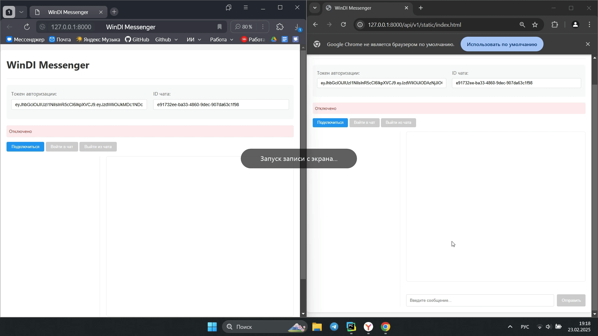

# WinDI Messenger

WinDI Messenger — это мессенджер с функционалом обмена сообщениями в реальном времени и поддержкой групповых
чатов. Проект разработан с использованием **FastAPI** и **SQLAlchemy**.



## Функциональные возможности

- **Общение в реальном времени через WebSocket**  
  Подключение пользователей через WebSocket для обмена текстовыми сообщениями.  
  *Отметка сообщений как прочитанных с последующим уведомлением отправителя.*

- **Групповые и личные чаты**  
  Возможность создания личных чатов между двумя пользователями и групповых чатов с несколькими участниками.

- **История сообщений**  
  REST-эндпоинт для получения истории сообщений по ID чата с поддержкой пагинации. Сообщения сортируются по времени
  отправки (по возрастанию).

- **Авторизация и безопасность**  
  Использование JWT для аутентификаци.

## Архитектура проекта

Проект структурирован с чётким разделением ответственности:

- **Controllers** — обработка HTTP-запросов и WebSocket-соединений.
- **Services** — бизнес-логика.
- **Repositories** — взаимодействие с базой данных через SQLAlchemy (CRUD-операции для пользователей, чатов, групп,
  сообщений).
- **Models и Schemas** — описание структуры данных и валидация входных/выходных данных с помощью Pydantic.

## Установка и запуск

### Требования

- Docker и Docker Compose
- Git

### Запуск через Docker Compose

1. **Клонируйте репозиторий:**

   ```bash
   git clone https://github.com/bodaue/windi-messenger.git
   cd windi-messenger
   ```

2. **Настройте переменные окружения:**

   Отредактируйте файл [.env](.env) при необходимости (пример можно найти в файле [.env.example](.env.example)).
   Основные переменные:
    - `SERVER_HOST`, `SERVER_PORT`
    - `POSTGRES_HOST`, `POSTGRES_PORT`, `POSTGRES_USER`, `POSTGRES_PASSWORD`, `POSTGRES_DB`
    - `JWT_SECRET_KEY`, `JWT_ALGORITHM`, `JWT_ACCESS_TOKEN_EXPIRES_MINUTES`

3. **Запустите проект:**

   ```bash
   docker-compose up --build
   ```

   Приложение будет доступно по адресу [http://localhost:8000](http://localhost:8000).

### Миграции базы данных

Миграции применятся автоматически при первом запуске

## API Документация

Автоматическая документация доступна по следующим адресам:

- Swagger UI: [http://localhost:8000/docs](http://localhost:8000/docs)
- ReDoc: [http://localhost:8000/redoc](http://localhost:8000/redoc)

## Примеры использования API

### Регистрация и авторизация

- **Регистрация пользователя**

  **POST** `/auth/register`

  Пример тела запроса:
  ```json
  {
    "name": "Иван Иванов",
    "email": "ivan@example.com",
    "password": "securepassword"
  }
  ```

- **Аутентификация пользователя**

  **POST** `/auth/login`

  Пример тела запроса:
  ```json
  {
    "email": "ivan@example.com",
    "password": "securepassword"
  }
  ```

  В ответ возвращается JWT-токен, который необходимо использовать в заголовке `Authorization` для доступа к защищённым
  эндпоинтам.

### Чаты и групповые чаты

- **Создание личного чата**

  **POST** `/chats`  
  Тело запроса:
  ```json
  {
    "user_id": "UUID_другого_пользователя"
  }
  ```

- **Получение списка чатов пользователя**

  **GET** `/chats`

- **Получение истории сообщений чата**

  **GET** `/messages/history/{chat_id}`  
  Параметры запроса:
    - `limit` (опционально, по умолчанию 50)
    - `offset` (опционально, по умолчанию 0)

### WebSocket-соединение

Для подключения к WebSocket используйте URL:  
`ws://localhost:8000/ws`

При подключении необходимо передать валидный JWT-токен. Далее клиент может отправлять сообщения с действиями:

- `join_chat` — присоединиться к чату
- `leave_chat` — покинуть чат
- `send_message` — отправить сообщение
- `message_read` — уведомить о прочтении сообщения
- `typing` - уведомить о том, что пользователь печатает

Пример сообщения для отправки:

```json
{
  "action": "send_message",
  "chat_id": "UUID_чата",
  "text": "Привет, как дела?"
}
```

Статика и веб-интерфейс для WebSocket

В проекте реализован простой веб-интерфейс для WebSocket. Он позволяет в браузере подключаться к серверу (по адресу
http://127.0.0.1:8000/api/v1/static/index.html), тестировать обмен сообщениями в реальном времени и проверять работу
WebSocket-соединения.

## Создание тестовых данных

Для быстрого заполнения базы данных тестовыми данными можно использовать специальную команду (после запуска
контейнеров):

```bash
docker-compose exec backend python -m scripts.create_test_data
```

## Структура проекта

```
windi-messenger/
├── alembic/                # Миграции базы данных
├── src/                    # Исходный код приложения
│   ├── api/                # Роутеры и эндпоинты
│   ├── core/               # Конфигурация, DI, база данных
│   ├── models/             # ORM-модели
│   ├── repositories/       # Доступ к данным
│   ├── schemas/            # Схемы Pydantic
│   ├── services/           # Бизнес-логика
│   └── main.py             # Точка входа приложения
├── scripts/                # Скрипты (например, для создания тестовых данных)
├── Dockerfile
├── docker-compose.yml
├── pyproject.toml
└── README.md
```